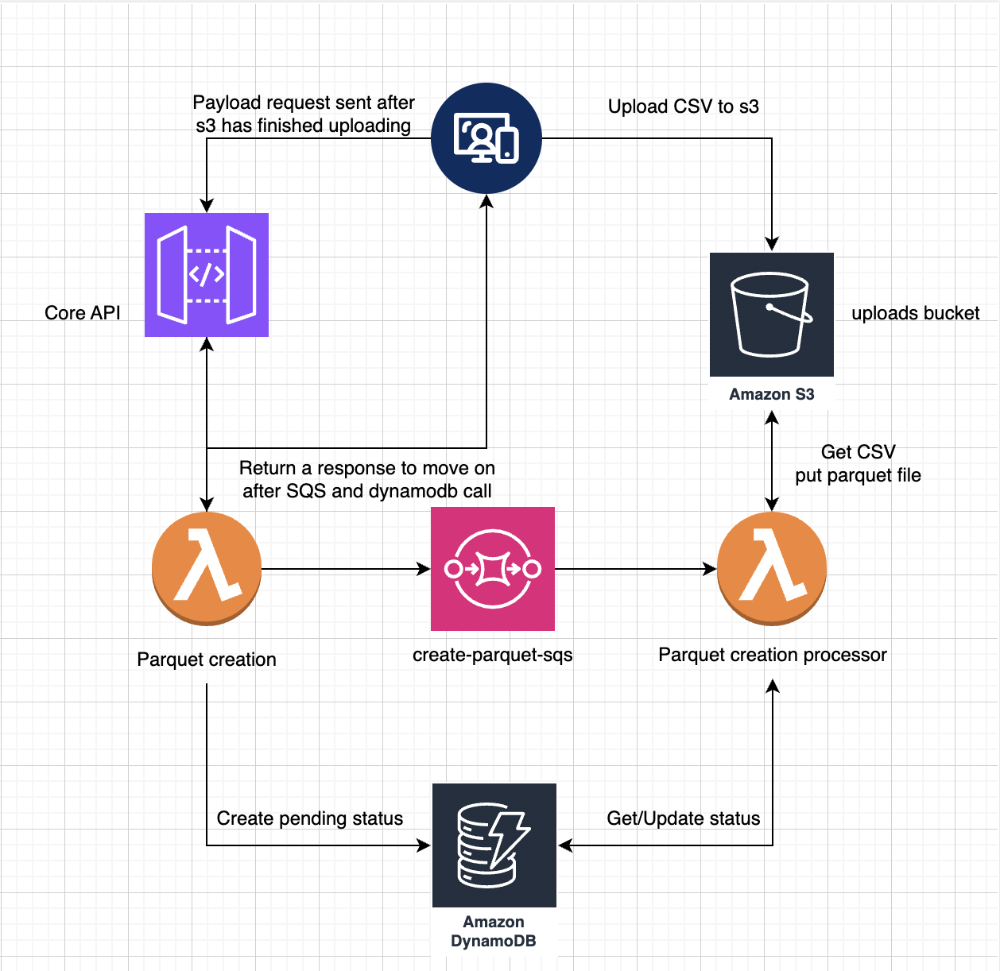

## Required to deploy

node: https://nodejs.org/en/download
npm: https://www.ramotion.com/blog/how-to-install-npm/
rust: https://www.rust-lang.org/tools/install
cargo: https://doc.rust-lang.org/cargo/getting-started/installation.html

I am using the following for the demo
node: 23.6
npm: 11.4
rust: 1.87
cargo: 1.87

## Good to knows

Infrastructure is deployed via sst v3. If you are deploying with a windows machine it's currently in beta, if you work on a linux/unix machine it should work fine.
https://sst.dev/docs/start/aws/svelte/#serverless

You will need to have your aws credentials configured via the CLI to deploy.

### Bedrock gotchas

Currently I am deploying in `ap-southeast-2` and I require an instance profile on bedrock to infer across region for claude. If you are deploying via a region that doesn't support cross region inference for claude, you will need to update `src/backend/parquet/generate-query/index.rs`, line 127 and 165 with the correct modelId.

## Tools used

- SvelteKit 5: https://svelte.dev/docs/kit/introduction,https://sst.dev/docs/start/aws/svelte/#serverless
- Cloudfront to deploy the website
- SST V3: https://sst.dev/docs/start/aws/svelte/#serverless
- Backend is rust
- Frontend uses Typescript/Javascript, HTML and CSS
- AWS Services used: Lambda, API Gateway, S3, SQS, DynamoDB, Bedrock
- Used Claude 4 to assist with developemnt

## Installing everything

Pull the repo
`npm run install`
`npx sst install`
`cargo build --release` OR `cargo build`. --release takes longer but the code will run quicker.

## how to deploy

Ensure that you have ran the install step above
Ensure that your AWS credentials are configured via the CLI.

**If you want to deploy to a different region change the provider.aws.region field in sst.config.ts on line 13, otherwise it will deploy to ap-southeast-2, if you change it you will need to run cargo build again then deploy**

`npx sst deploy --stage prod`

## Submisison details

### Inspiration

My name is [Damien Pace](https://www.linkedin.com/in/damienpace1/) and I am a solution architect at Acciona in Melbourne, Australia. I was a backend engineer that mainly worked with Lambda for my first 3.5 years of my career. I love Lambdas so I thought this would be a perfect hackathon for me.

I currently work in an enterprise environment where people get lots of data from 3rd party sources that is just dumped into an excel spreadsheet and I get approached multiple times a month with conversations go like this.

colleague: "Hey Damien, I am working with an excel spreadsheet..."  
Damien: "Is there too much data on it and you either can't open it or it's just getting slower by the day?"  
colleague: "How'd you know?"  
Damien: 😀 

Sometimes these people need a database or need something in a datalake and with limited resources it can leave them blocked for weeks or months. Some colleagues don't have the technical skills or have some limited Python knowledge and run local scritps that takes days and a lot of LLM calls vibe coding their way into a mess.

So I started thinking, surely I could make something to help them out? Then as my 3 year old son came around the corner with his hand on his arm shooting a lazer at me screaming "BUZZ LIGHTYEAR!" I thought "what would buzz do?". Then it hit me, buzz would finish the mission. That's how Buzz CSV was born. I wanted to give them something that went above and beyond a CSV.

## How does Buzz work in lambdas?

There are 2 different flows

### Processing the CSV file into a parquet file

### High level breakdown

- User uploads a csv file to s3
- On succesful upload, trigger a lambda via an api gateway
- parquet creation producer lambda sends a payload for the csv file to be processed asynchronously
- creates a dynamoDB record with a pending state, context, and schema for the frontend display
- return success to the user

### Breaking down the important lambda

In this flow the most important lambda is the `parquet-creation-processor`.

In the spirit of lambda and how I like to build, I didn't want to get into a situation where a user would hit some limitations with file size either saving it into memory or in ephemeral storage as both have a 10GB hard limit.

If I started off small and had a file that ran out of memory I could just up the lambda memory and storage space, but I am just delaying the inevitable of running into the same problem again beacuse I haven't actually fixed the problem, I am just throwing more memory and storage at a bad design.

It also makes it harder to extend in the future if I ever get time, I can see a future where people need to query multiple related datasets at the same time.

I wanted this be quick and efficient (written in rust btw) so I set a memory limit of 3008MB, I was finding mixed answers regarding vcpu and how it scales with memory so I used [this artcle](https://dev.to/takuma818t/lambda-performance-evaluation-the-relationship-between-memory-and-internal-vcpu-architecture-and-their-comparison-3911) and pushed it to the max memory for 2 vcpus.

### Multithreaded CSV to Parquet Conversion System

### Overview

This system processes large CSV files from S3 and converts them to optimized Parquet format using a producer-consumer pattern with async Rust and Tokio channels.
Architecture Flow

┌─────────────────┐ ┌──────────────────┐ ┌─────────────────┐
│ SQS Message │───▶│ Lambda Handler │───▶│ S3 Upload │
│ │ │ │ │ │
│ - job_id │ │ Coordinates the │ │ Final .parquet │
│ - s3_key │ │ entire process │ │ file storage │
│ - column_defs │ │ │ │ │
└─────────────────┘ └──────────────────┘ └─────────────────┘
│
▼
┌──────────────────┐
│ Multi-threaded │
│ Processing Core │
└──────────────────┘

Core Multithreading Pattern
The system uses a Producer-Consumer pattern with two main threads:

### Thread 1: CSV Processor (Producer)

- Purpose: Stream and parse CSV data from S3
- Operations:
  - Downloads CSV in 512MB chunks
  - Parses CSV lines with custom parser
  - Converts raw strings to typed values (FieldValue enum)
  - Batches rows (3.5M rows or 1.8GB per batch)
  - Sends RecordBatch objects through channel

Thread 2: Parquet Writer (Consumer)

Purpose: Write optimized Parquet files
Operations:

Receives RecordBatch objects from channel
Converts to Arrow columnar format
Writes compressed Parquet with SNAPPY compression
Uploads final file to S3

Detailed Threading Diagram
┌─────────────────────────────────────────────────────────────────┐
│ Main Thread │
│ ┌─────────────────┐ ┌───────────────────┐ │
│ │ Lambda Entry │────────────────────▶│ Parquet Writer │ │
│ │ Point │ │ (Consumer) │ │
│ └─────────────────┘ └───────────────────┘ │
│ │ ▲ │
│ ▼ │ │
│ ┌─────────────────┐ ┌─────────────────┐ │ │
│ │ Spawn Processor │ │ Channel │ │ │
│ │ Task │ │ (Buffer: 8) │──────┘ │
│ └─────────────────┘ └─────────────────┘ │
│ │ ▲ │
│ ▼ │ │
│ ┌─────────────────────────────────┴─────────────────────────┐ │
│ │ Spawned Task Thread │ │
│ │ ┌─────────────────────────────────────────────────────┐ │ │
│ │ │ CSV Processor (Producer) │ │ │
│ │ │ │ │ │
│ │ │ 1. Stream from S3 (512MB chunks) │ │ │
│ │ │ 2. Parse CSV lines │ │ │
│ │ │ 3. Convert to typed FieldValues │ │ │
│ │ │ 4. Batch rows (3.5M rows/1.8GB) │ │ │
│ │ │ 5. Create RecordBatch │ │ │
│ │ │ 6. Send via channel ─────────────────────────────────┘ │
│ │ └─────────────────────────────────────────────────────┘ │
│ └─────────────────────────────────────────────────────────────┘
└─────────────────────────────────────────────────────────────────┘
Memory Management Strategy
The system is optimized for 2.6GB Lambda memory with careful resource allocation:
┌─────────────────────────────────────────────────────────────┐
│ Memory Allocation │
│ │
│ CSV Processing Thread: │
│ ├─ S3 Read Buffer: 512MB │
│ ├─ Batch Memory: 1.8GB (3.5M rows) │
│ └─ String Pool: ~50K strings for deduplication │
│ │
│ Parquet Writing Thread: │
│ ├─ Arrow Arrays: Dynamic based on batch │
│ ├─ Parquet Buffer: 512MB │
│ └─ Compression Buffer: Dynamic │
│ │
│ Channel Buffer: 8 RecordBatch objects │
│ │
│ Total: ~2.6GB peak usage │
└─────────────────────────────────────────────────────────────┘
Data Flow Pipeline
┌─────────┐ ┌─────────┐ ┌─────────┐ ┌─────────┐ ┌─────────┐
│ S3 │───▶│ CSV │───▶│ Batch │───▶│ Record │───▶│ Parquet │
│ File │ │ Parser │ │ Builder │ │ Batch │ │ Writer │
└─────────┘ └─────────┘ └─────────┘ └─────────┘ └─────────┘
│ │ │ │ │
▼ ▼ ▼ ▼ ▼
Raw CSV String Arrays OptimizedRow Arrow Arrays Compressed
Data + Type Conv. Collections (Columnar) Binary Data
