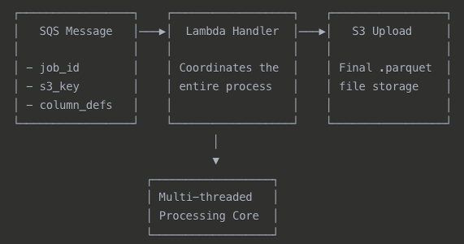
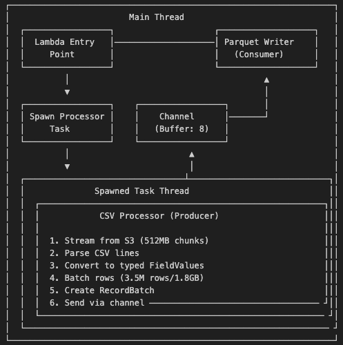
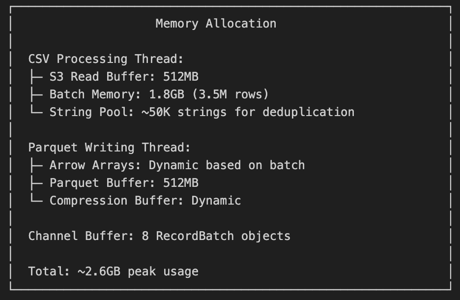
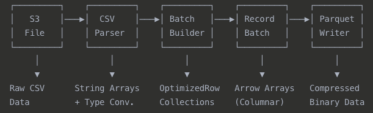
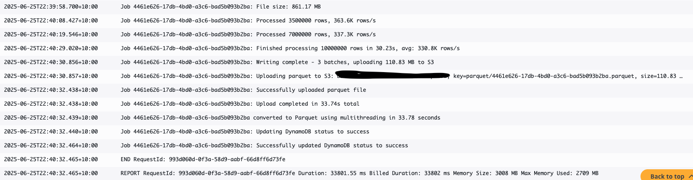
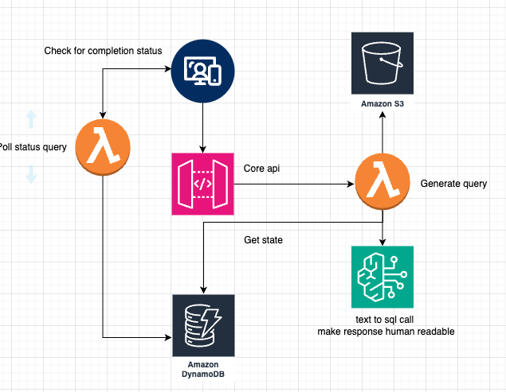

## AWS Lambda Hackathon Submission details

This is my submission for https://awslambdahackathon.devpost.com/

Live demo website: https://d396qtz3n6aw4l.cloudfront.net (please note I haven't touched this in a few months due to life, and I know that bedrock has changed some things so you will most likely get errors D:) 

(I suggest testing on this website as you might run into some problems with deploying in other regions due to bedrock inference across regions, if you are comfortable go ahead and change some stuff 🚀)

### Inspiration

My name is [Damien Pace](https://www.linkedin.com/in/damienpace1/) and I am a solution architect at Acciona in Melbourne, Australia. I was a backend engineer that mainly worked with Lambda for my first 3.5 years of my career. I love Lambdas so I thought this would be a perfect hackathon for me. My career history explains exactly why my frontend code and UX looks like a career backend dev has done it.

I currently work in an enterprise environment where people get lots of data from 3rd party sources that is just dumped into an excel spreadsheet and I get approached multiple times a month with conversations go like this.

Colleague: "Hey Damien, I am working with an excel spreadsheet..."  
Damien: "Is there too much data on it and you either can't open it or it's just getting slower by the day?"  
Colleague: "How'd you know?"  
Damien: 😀 

Sometimes these people need a database or need something in a datalake and with limited resources it can leave them blocked for weeks or months. Some colleagues don't have the technical skills or have some limited Python knowledge and run local scripts that takes days and a lot of LLM calls vibe coding their way into a mess.

So I started thinking, surely I could make something to help them out? Then as my 3 year old son came around the corner with his hand on his arm shooting a laser at me screaming "BUZZ LIGHTYEAR!" I thought "what would buzz do?". Then it hit me, buzz would finish the mission. That's how Buzz CSV was born. I wanted to give them something that went above and beyond a CSV.

## Tools used

- SvelteKit 5: https://svelte.dev/docs/kit/introduction https://sst.dev/docs/start/aws/svelte/#serverless
- Cloudfront to deploy the website via SST V3
- SST V3: https://sst.dev/docs/start/aws/svelte/#serverless
- Backend is rust
- Frontend uses Typescript/Javascript, HTML and CSS
- AWS Services used: Lambda, API Gateway, S3, SQS, DynamoDB, Bedrock
- Used Claude 4 to assist with development

## How do Buzz and Lambdas work together?

There are 2 different flows

### Processing the CSV file into a parquet file

### High level breakdown

- User uploads a csv file to s3
- On successful upload, trigger a lambda via an api gateway
- parquet creation producer lambda sends a payload for the csv file to be processed asynchronously
- creates a dynamoDB record with a pending state, context, and schema for the frontend display
- return success to the user

### Breaking down the parquet-creation-processor

In the spirit of lambda and how I like to build, I didn't want to get into a situation where a user would hit some limitations with file size either saving it into memory or in ephemeral storage as both have a 10GB hard limit.

If I started off small and had a file that ran out of memory I could just up the lambda memory and storage space, but I am just delaying the inevitable of running into the same problem again because I haven't actually fixed the problem, I am just throwing more memory and storage at a bad design.

It also makes it harder to extend in the future if I ever get time, I can see a future where people need to query multiple related datasets at the same time.

I wanted this be quick and efficient (written in rust btw 🦀) so I set a memory limit of 3008MB, I was finding mixed answers regarding vcpu and how it scales with memory so I used [this article](https://dev.to/takuma818t/lambda-performance-evaluation-the-relationship-between-memory-and-internal-vcpu-architecture-and-their-comparison-3911) and pushed it to the max memory for 2 vcpus.

### Multithreaded CSV to Parquet Conversion System

### Overview

I went with a system that processes large CSV files from S3 and converts them to optimized Parquet format using a producer-consumer pattern with async Rust and Tokio channels. I wanted to push some boundaries with the memory limit and hover around 90 percent utilization.

Architecture Flow

## Core Multithreading Pattern

**Producer-Consumer pattern** with two main threads

### Thread 1: CSV Processor (Producer)

**Purpose:** Stream and parse CSV data from S3

**Operations:**

- Downloads CSV in 512MB chunks
- Parses CSV lines with custom parser
- Converts raw strings to typed values (FieldValue enum)
- Batches rows (3.5M rows or 1.8GB per batch)
- Sends RecordBatch objects through channel

### Thread 2: Parquet Writer (Consumer)

**Purpose:** Write optimized Parquet files

**Operations:**

- Receives RecordBatch objects from channel
- Converts to Arrow columnar format
- Writes compressed Parquet with SNAPPY compression
- Uploads final file to S3

### Memory Management Strategy

The system is optimized for 2.6GB Lambda memory with careful resource allocation:

### Data Flow Pipeline

### Results

This is still being tested, coming across some big test data is not the easiest thing to find.

### What's next?

The state of the job record is updated to success and we move onto the chat functionality.

## The second flow

Once the chat page has loaded, it will trigger a lambda via API Gateway and poll continuously until it receives a success response from dynamoDB.

## Breaking down the important lambda for the query flow

## What was the approach?

This lambda changed multiple times and had a few trade offs in regards to reading the parquet file and performing SQL queries.

## What this lambda does

- download parquet in memory (I know I have contradicted myself above, but there is a reason)
- create in memory duckdb client
- generate a request based off the question and the schema using claude 4 and bedrock
- use that SQL query with duckdb to read data from in memory parquet file
- make results human readable with claude 4

You may be asking how long does this take?

Overall I was getting consistent 4-6 second response times, sometimes more sometimes less. That means from the moment someone asks Buzz a question, most of the time they would have answers to what they asked in 4-6 seconds, no matter the data size. I tried this on 1,000 rows and 10 million rows. Buzz was deployed in `ap-southeast-2` on all datasets. 

But Damien... why does `ap-southeast-2` matter?

I am using bedrock since data will be safe and not used to train models and I want enterprise people to use this, data sensitivity and safety that it will not be stolen is number 1 when it comes to enterprise and LLM use. This means that I will get some extra latency doing a round trip to the states. (No hyperspeed for Buzz 🥲)

I also can init the duckdb instance to be shared across invocations but I honestly have just ran out of time to do anymore as a full time working dad, you can spiral into rabbit holes for the rest of your days about how you can optimize your side projects to shave off 0.1 seconds of latency. We've all been there.

I suspect this would cut off a second or two if it was deployed in the states and had some minor optimizations. But that's for another version.

## How does my natural language get data from a parquet file?

Using Claude and the schema that gets auto inferred at upload of the CSV file on the frontend Buzz generates some optimised SQL for you.

The full prompt is in `src/backend/common/src/query_prompts.rs` but it has a few rules.

- Only generate SQL based off the schema and the question the user has inputted.
- a bunch of SQL and duckDB SQL optimizations courtesy of Claude 4.
- and rules around variations

Variations in this context are important, when I was doing my testing I found myself trying to type SQL in normal English which just seemed like a massive sticking point from an end user perspective, they might as well go learn SQL. You'd need to know what's exactly in your dataset.

Buzz can figure out what you are looking for and search for items with different variations. If you had a dataset containing data about food and drinks, and you needed to know what drinks were most popular. A drink could be a coke, alcohol, water or anything in between. You would have to explicitly state that you are looking for all of the above. Instead you can just say "I need to know how many drinks were purchased" then Buzz will finish the mission.

To make it human readable I added in a context box to the data where users could get as detailed as they like. 

### How did this lambda evolve over time?

First approach was using a [polars crate](https://docs.rs/polars/latest/polars/index.html) and querying directly from an S3 bucket with the generated SQL. But I soon discovered that Polars SQL was slightly different and I didn't want to rely on heavy prompting to get results.

I also considered Athena but I wanted to keep this as lambda as possible and only use AWS resources it would be impossible to create myself (I would love to recreate s3 and api gateway but I don't have the time and honestly the skills).

Getting duckdb to play nicely with s3 and querying it directly was a few hours of headaches, it had something to do with the binaries of the duckdb crate and lambda not being compatible. I considered using a docker image but thought it's just not worth it when I can download the parquet in memory and deal with it another time.

## Required to deploy

node: https://nodejs.org/en/download  
npm: https://www.ramotion.com/blog/how-to-install-npm/  
rust: https://www.rust-lang.org/tools/install  
cargo: https://doc.rust-lang.org/cargo/getting-started/installation.html  

I am using the following for the demo  
node: 23.6  
npm: 11.4  
rust: 1.87  
cargo: 1.87  

## Good to knows

Infrastructure is deployed via sst v3. If you are deploying with a windows machine it's currently in beta, if you work on a linux/unix machine it should work fine.
https://sst.dev/docs/start/aws/svelte/#serverless

You will need to have your aws credentials configured via the CLI to deploy.

### Bedrock gotchas

Currently I am deploying in `ap-southeast-2` and I require an instance profile on bedrock to infer across region for claude. If you are deploying via a region that doesn't support cross region inference for claude, you will need to update `src/backend/parquet/generate-query/index.rs`, line 127 and 165 with the correct modelId.

## Installing everything

Pull the repo  
`npm run install`  
`npx sst install`  
`cargo build --release` OR `cargo build`. --release takes longer but the code will run quicker.

## How to deploy

Ensure that you have ran the install step above
Ensure that your AWS credentials are configured via the CLI.

If you want to deploy to a different region `change the provider.aws.region field in sst.config.ts on line 13`, otherwise it will deploy to `ap-southeast-2`, if you change it you will need to run cargo build again then deploy

`npx sst deploy --stage prod`

## BEWARE

This is a demo and test client, upload your own dataset at your own risk. I suggest using the below or finding something online that interests you. Don't use company data on this demo and POC please.

## Datasets

Here are some datasets found online to help speed up looking for some

- https://www.kaggle.com/datasets/sahirmaharajj/electric-vehicle-population
- https://www.kaggle.com/datasets/ka66ledata/project-management-risk-raw
- https://www.kaggle.com/datasets/neuralsorcerer/geographic-product-demand-dataset
